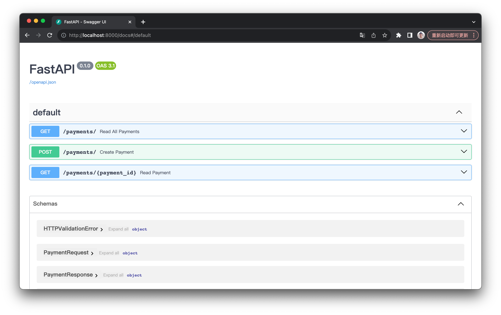

# sql_app_payment
## How to run this repo:

clone this repository:
```
git clone git@github.com:processout-hiring/payment-gateway-putongyong.git
```

go to main branch
```
git checkout main
```

**With docker:**

build docker image:
```
docker build -t python-payment-app .
```

run docker image:
```
docker run --rm -it -p 8000:8000 python-payment-app
```

The app will be running at Localhost:8000

**Without docker:**

Make sure that python is installed in your environment

Create a python virtual environment:
```
python3 -m venv venv
```

Activate the environment (the following is an example for mac):
```
source venv/bin/activate
```

Install dependencies:
```
pip install -r requirements.txt
```

Run main.py
```
python3 main.py
```

The app will be running at Localhost:8000

## How to interact with the app

Since I am using fastapi as framework, and since fastapi provides a build-in interface using Swagger UI, you can go to Localhost:8000/docs to checkout the interface.



**Two main endpoints**

1. POST /payments/

This is to add a new payment request.

2. POST /payments/{payment_id}

This is to retrieve any previous payment history by an id

**Bonus endpoint**

GET /payments/

This is to retrieve all previous payment histories, in order to improve the view for admin.

## Technologies

Language: **Python**
Framework: **FastAPI**
ORM: **SQLalchemy**
Test: **Pytest**
Containerization: **Docker**

## What I have done

1. A CRUD web application to insert data to the database and retrieve it from the database
2. A simulator of bank reaction for testing. This simulator will randomly return an id and a successful/failed answer.
3. A lightweight memory based database SQLite for testing. 
4. Test tool by pytest, and a testing database.
5. Documentations.

## What I can improve for this project

1. Using python tools like Alembic to improve database migration. This will help to update the database structure if we add new models, and it will provide a history of these updates.
2. Replace Database by more solid ones like Postgresql.
3. More strict typing rules. For example, the input id length will not be accepted if the length is not exactlly the same as a bank card number length. 
4. Add a column like 'payment_history_status' for payment table so that we can track the status of one payment history. For example, it can be archived, expired, or finished.
5. Create a table for users and their roles. Theses will help to create different views.
6. We can also add more endpoints for different roles. For example, admin should be able to see all payment history (from certain date to certain date), and even be able to archive it.

## What cloud technologies I would use and why.

I would use AWS or Azure as cloud plateform. The reason is that they are the most solid ones currently in the market.

I would use docker for containerizing the app, and kubernetes for controling containers.

The idea is that, containerization with docker provide isolation of different instances, and it will make they excutable in any infrastructure, as long as this infrastructure supports docker.

With kubernetes, we can have a better scalability and monitoring of the containers. For example, we can easily replace unhealthy containers by healthy ones, without letting go the logs from the previous containers (though this may need more configuration for persistent volume).

At peak moment, with containerization technologies like docker and kubernetes, we can also better handle high concurrency issues.


 
